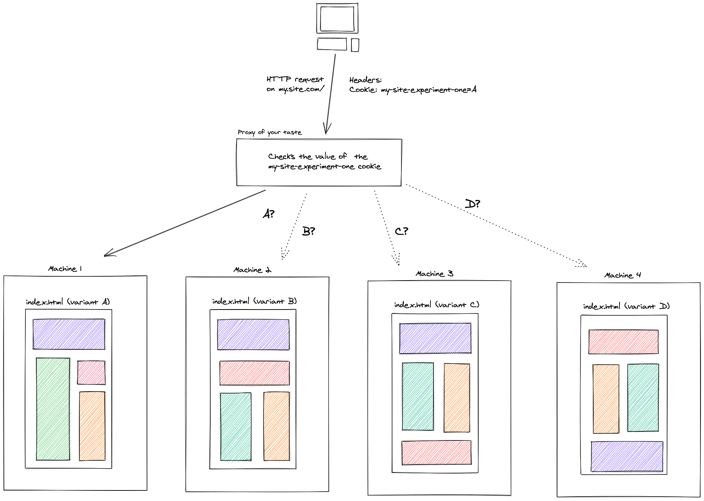

The JAMstack has been talked about in recent years like a way to create static websites that scales very well in many different ways.
Since it becomes more and more mainstream, it made sense to people to think about how to apply older patterns that we like in this
quite particular context.

In this post, I will share with you **my vision** of A/B testing with the JAMstack.

## But first, why do we use the JAMstack?

According to [jamstack.org](https://jamstack.org/), we use it because:

- it's about building **simple static pages** (HTML files)
- most of the job is made at build-time, no potential leak at runtime, it's more **secured**
- static pages are basically HTML files and thus **load very fast**
- we benefit from **cheap hosting** (putting files on a server and there we go)
- it's **highly scalable**, just put the files on another machine and scaling is done
- it already exists great tools to create amazing sites ([Gatsbyjs](https://www.gatsbyjs.com/), [Nextjs](https://nextjs.org/), [11ty](https://www.11ty.dev/), [etc...](https://jamstack.org/generators/))

## Why do we use A/B testing?

People use A/B testing to measure which variant of a website is more appreciated by their users. The idea is simply to provide different visual representations
of some data and check which one attracts more people.


If the visitors of the variant A come more often than the visitors of the variant B, then we can assume that variant A is a more viable solution to represent the data on the page.

## How do we use A/B testing in non JAMstack applications?

In applications that are not built on top of the JAMstack, the idea is quite straightforward.

When opening the application, it will make a request to a remote server to get the different available variants. Then, based on some conditions in the codebase, we are able to display the good variant to the good user.

The following is an example of a client-side A/B test written with [Reactjs](https://reactjs.org/):

```jsx
const App = () => {
  const { variant, isLoading } = useABVariant();

  if (isLoading) {
    return <p>Preparing the application...</p>;
  }

  if (variant === "A") {
    return <div>Here's the A variant!</div>;
  }

  return <div>Here's the B variant!</div>;
};
```

As we see in the snippet, the code is executed in the user's browser. Also notice **the loading information while the request is pending** before being able to display the variant content.

The following is a tiny sandbox allowing to switch on and off a feature flag to display a new variant of a homepage. When using services like [LaunchDarkly](https://launchdarkly.com/), this is exactly the kind of actions you're provided with.

## Why A/B testing on the JAMstack is different?

Remember one of the main arguments of building on top of the JAMstack is **fast page loading** (performance).

When dealing with A/B tests the "standard way", **we need to make an HTTP request to get the different variants**. Making an HTTP request means that **there is a delay** between the moment we ask for the variants and the moment we get them back from the server.

The problem is that **making the HTTP request is so critical** that we can't show anything else than a loading information to the user before resolving the variants and being able to show them the good content.

**In a static environment, we are waiting for a dynamic information to display meaningful information.**

When A/B testing the "standard way", using runtime information will **make the application performances worse by increasing the time for the displaying the first meaningful content**. Loading static pages should be "instant" but relying on an HTTP request and an intermediate loading state before displaying the content will take extra time and decrease the experience.

In some scenarios, [Lighthouse](https://developers.google.com/web/tools/lighthouse) performance score can drop by around `25` points (up to you to determine if it's significant or not).

Also note that some tools helping building applications using the JAMstack **don't even run JavaScript at all**, meaning that it's not possible to rely on HTTP requests to access remote data at runtime.

## How to make A/B testing in a JAMstack fashion?

The JAMstack is about **building static pages**. Taking this notion to the extreme, we can imagine creating a dedicated set of static pages for different variants and host them in different places, like for example, different machines.


**The machine 1** owns all the statically generated HTML pages impacted by the variant A and **the machine 2** owns all of the statically generated HTML pages of the variant B.

Since pages are statically generated at build time, we can rely on environment variables to display the good variant content:

```jsx
const AB_EXPERIMENT_VARIANT = process.env.AB_EXPERIMENT_VARIANTS;

const App = () => {
  if (AB_EXPERIMENT_VARIANT === "A") {
    return <div>Here's the A variant!</div>;
  }

  return <div>Here's the B variant!</div>;
};
```

The next step is to rely on some kind of proxy to route the different users to one of the two variants and make sure they always see that variant.

Remember, **we can't rely on runtime information to store the variant**, like an authenticated user id for example. We need to rely on something else. Hopefully, [HTTP Cookies](https://developer.mozilla.org/en-US/docs/Web/HTTP/Cookies) exist that allow for a client-server kind of data sharing. We can benefit from them to store the actual variant requested by the user and make sure that they will always get routed to that variant.


## Observations on this approach

The first observations to push upfront is that **we have kept the page loading performances provided by default by the JAMstack**. We don't have to wait for runtime computations to display content on the page.

The second observation is about the tradeoffs we decided to make: we shifted the A/B testing responsibility **closer to the infrastructure layer**. The proxy has an important role to play in this scenario.

Also note that we need more "places" to put the different variants: 1 variant corresponds to 1 website that corresponds to 1 set of static pages that should entirely be hosted. **The more we have variants, the more we may pay for hosting**:



There's also one side effect that I find positive (but it can feel negative) is that it can be hard to combine multiple A/B experiments.

Let's say that we have 2 pages and that we want to run an experiment on both the pages:

- What can be a visual representation of these scenarios at the hosting level?
- Should we create 4 different websites, one for each variant?
- Should we create N different websites with combinations of variants?

## References

If you're using [Netlify]() for hosting your websites, they have a feature called [Split-testing](https://docs.netlify.com/site-deploys/split-testing/) that allows for these kind of testing using a branch based approach.

If you have any other references in mind concerning A/B testing or Split Testing on top of the JAMstack, feel free to drop them on [Twitter](https://twitter.com/mfrachet).
