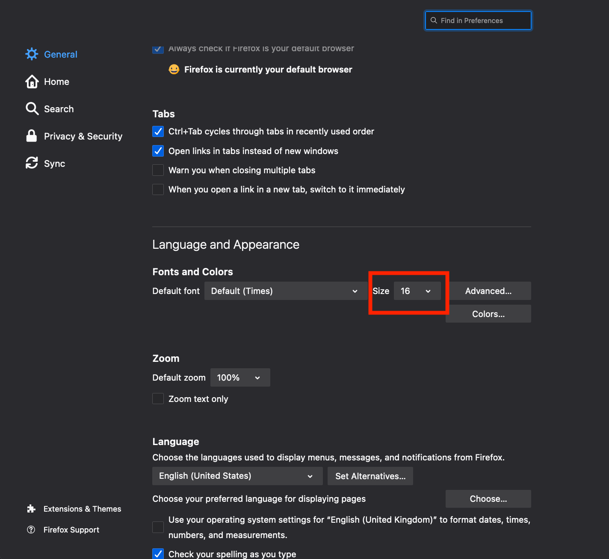

As front-end developers, our job is to provide a valid experience to people using our applications. Some of these users may not have excellent sight and will need to adjust the size of what they see on the screen to be able to read things correctly.

Using web browsers, these people have multiple ways to solve the text sizing problem including:

- zoom-in using the browser's built-in zoom functionality (`cmd + plus` on OSX)
- defining a preferred font-size in their browser settings

The built-in zoom functionality is a very nice feature: it reduces the viewport width and zoom-in the content directly. It can trigger responsive mechanisms such as media-queries. For instance, if you zoom enough on this website, you'll see the menu disappearing and a navbar appearing.

Concerning the preferred font-size set in the browser settings, there is a debate where some people argue that the zoom functionality is enough to provide a valid user experience. However, I personally think that if some users have defined a custom font-size in their preferences, I have to respect that and provide them with a valid experience.

## How to deal with users' preferred font-size?

The answer to this problem is to adjust the content displayed on a website based on the users' preferred font-size. While this might sound obvious, it's not that obvious in practice.

To create UIs on the web, we use the CSS language. In this language, [multiple units can be applied to properties](https://developer.mozilla.org/en-US/docs/Learn/CSS/Building_blocks/Values_and_units). The CSS language itself doesn't take part in any of these and leaves the developers to choose what is the most convenient for them.

For me, the easiest to represent as a concept is the `px` one: it's an absolute tangible unit representing a concrete shape on the screen. The problem with `px` is that it's an absolute tangible unit representing a concrete shape on the screen.

Let's illustrate that. The following is a Codesandbox with a paragraph of `font-size: 10px`:

<iframe
  src="https://codesandbox.io/embed/laughing-shape-sm2xi?fontsize=14&hidenavigation=1&theme=dark"
  style="width:100%; height:500px; border:0; border-radius: 4px; overflow:hidden;"
  title="laughing-shape-sm2xi"
  allow="accelerometer; ambient-light-sensor; camera; encrypted-media; geolocation; gyroscope; hid; microphone; midi; payment; usb; vr; xr-spatial-tracking"
  sandbox="allow-forms allow-modals allow-popups allow-presentation allow-same-origin allow-scripts"
></iframe>

Now, I'm going to change my preferred `font-size` in [Firefox](https://www.mozilla.org/en-US/firefox/new/) following these steps:

- Open the Firefox preferences (`cmd + ,` on OSX)
- In the "General" section, go to the "Language and Appearance" sub-section
- Change the value of the "Size" dropdown



With my new preferred font-size set, I'm going to check back [the Codesandbox above](https://codesandbox.io/s/laughing-shape-sm2xi?file=/src/index.js). What I can see is that the paragraph has still a font-size of `10px` and that the content has not been adjusted with my preferred font-size: it has not scaled.

Let's check the associated CSS rule:

```css
p {
  font-size: 10px;
}
```

The `font-size: 10px` declaration means that the font-size of the `<p>` element will **always be 10 pixels no matter what happens**.

## What can we do instead?

As mentioned earlier, it exists multiple CSS units and some of these are "relative units". In this post, I will deal with the `rem` one. `1rem` corresponds to "1 time the font size of the root element".

In this new Codesandbox, I've modified the paragraph to have a font-size of `1rem`:

<iframe
  src="https://codesandbox.io/embed/nifty-murdock-0huf0?fontsize=14&hidenavigation=1&theme=dark"
  style="width:100%; height:500px; border:0; border-radius: 4px; overflow:hidden;"
  title="nifty-murdock-0huf0"
  allow="accelerometer; ambient-light-sensor; camera; encrypted-media; geolocation; gyroscope; hid; microphone; midi; payment; usb; vr; xr-spatial-tracking"
  sandbox="allow-forms allow-modals allow-popups allow-presentation allow-same-origin allow-scripts"
></iframe>

When modifying the preferred font-size of the browser, we can see that the text has been scaled. If I modify this setting again, the text on the screen will change accordingly.

Let's check the associated CSS stylesheet:

```css
body {
  font-size: 100%;
}

p {
  font-size: 1rem;
}
```

The `font-size: 100%;` declaration tells the browser to use the users' preferred font-size as a default. In modern browsers, the default font size is set to `16px`.

The `font-size: 1rem;` declaration tells the browser that the `<p>` tag should be displayed using 1 time the size of the base font size (`16px` in this case)

As a result, the `body` font-size relates to the users' preferences and the `rem` unit relates to the `body` font-size: the `rem` unit scales based on the users' preferences.
